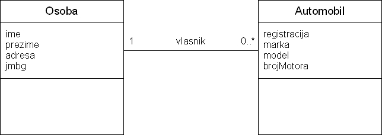
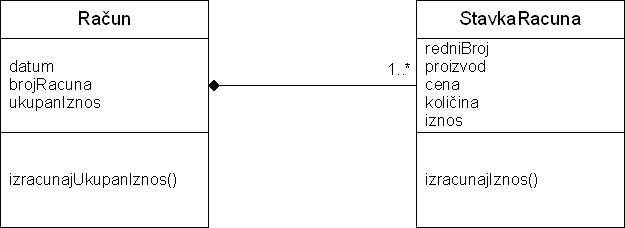
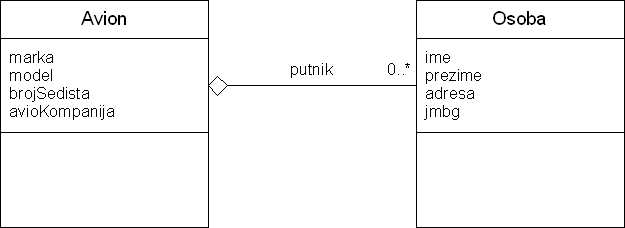
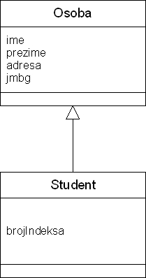
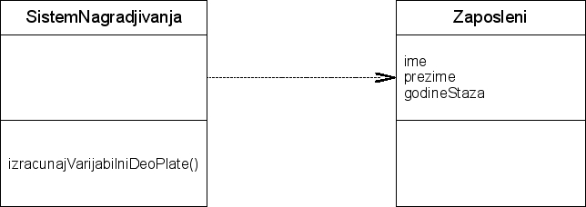

# Predavanje 2

	2.4 Metode - nastavak
	2.5 Konstruktori
	2.6 Statički elementi (static) - deo statički atributi
	2.7 Konstante (final)
	2.8 Nabrojivi tip (enum)
	2.9 Relacije
	3.1 IF naredba

# Zadatak 1

Napraviti klasu **Automobil** u paketu **dvocas2_sreda.zadatak1** koja ima:

- atribut **marka** koji predstavlja naziv marke automobila.
- atribut **model** koji predstavlja naziv modela automobila.
- atribut **kubikaza** koji predstavlja kubikazu motora (npr. 1998).
- atribut **snaga** koji predstavlja snagu motora u kilovatima (npr. 50.5).
- atribut **registarskaOznaka** koji predstavlja registraciju automobila (npr. "KG-123-CV").
- atribut **vlasnik** koji sadrži ime i prezime vlasnika automobila.
- atribut **vrstaGoriva** koji sadrži naziv vrste goriva koje koristi automobil.

- Metodu **ispisi** koja na ekranu ispisuje sve podatke o vozilu uz odgovarajući tekst.

Napraviti klasu **TestAutomobil** u paketu **dvocas2_sreda.zadatak1** koja ima main metodu u kojoj se pravi jedan objekta klase Automobil i puni sledećim podacima: "Nissan", "Micra", 1199, 50.5, "NS-567-HH", "Zika Zikic", "benzin". Ispisati na ekranu sve podatke o automobilu.

## Nabrojivi tip (enum)

**PROBLEM: Postoji ograničen skup vrsta goriva (benzin, dizel, gas, struja). Atribut vrstaGoriva je String pa korisnik može da unese bilo šta. Kako ograničiti unos samo na dozvoljene vrednosti?**

Napraviti nabrojivi tip **TipGoriva** u paketu **dvocas2_sreda.zadatak1** koji ima sledeće instance:

- BENZIN, DIZEL, GAS, STRUJA **(Nabrojivi tip - enum, instance, Java konvencija o nazivima za instance nabrojivog tipa)**

Ispraviti kod u klasi Automobil tako da atribut vrstaGoriva bude tipa TipGoriva. Ispraviti i kod u main metodi tako da se "benzin" unosi kao instanca nabrojivog tipa a ne kao String. **(pozivanje i korišćenje nabrojivog tipa)**

## Konstruktor

**PROBLEM: Upravo sam shvatio da je podugačak kod kojim se, posle inicijalizacije objekta, atributi tog istog objekta pune podacima. Da li postoji neki kraći način da se to lakše i brže uradi?**

Dodati u klasu Automobil:

- Konstruktor koji kao parametre prima vrednosti za sve atribute klase i postavlja te vrednosti u same atribute. **(šta je konstruktor, podrazumevani - default konstruktor i eksplicitno napisani konstruktor, parametrizovani konstruktor, rezervisana reč this)**
- Bezparametarski konstruktor. **(bezparametarski konstruktor i podrazumevani konstruktor)**
- Konstruktor koji kao parametre prima vrednosti za atribute marka, model, vrsta goriva, kubikaža i snaga i postavlja samo te vrednosti u istoimene atribute.**(klasa može imati više konstruktora, ali se moraju razlikovati po parametrima)**

Ispraviti kod u main metodi tako da se objekat inicijalizuje pozivom konstruktora. Napraviti još jedan objekat pozivanjem bezparametarskog konstruktora. **(pozivanje i korišćenje konstruktora)**

## Statički atributi i metode (static), konstante (final)

**PROBLEM: Upravo sam shvatio da mi je potrebno da imam i računanje snage motora u konjskim snagama (umesto u kilovatima). Bilo bi lepo da imam negde mali konvertor koji to radi i da ga onda koristim iz klase Automobil.**

Napraviti klasu **KonvertorSnage** u paketu **dvocas2_sreda.zadatak1** koja ima:

- Atribut **KS_KW** koji predstavlja koliko jedna konjska snaga iznosi kilovata. Postaviti da početna vrednost bude 0.74.
- Atribut **KW_KS** koji predstavlja koliko jedan kilovat iznosi konjskih snaga. Postaviti da početna vrednost bude 1.34.

- Metodu **konvertujUKS** koja kao parametar dobija snagu u kilovatima, pretvara u konjske snage (množenjem sa KW_KS) i vraća kao povratnu vrednost tako dobijeni broj.**(aritmetički operatori u Javi, deljenje celih i realnih brojeva)**
- Metodu **konvertujUKW** koja kao parametar dobija snagu u konjskim snagama, pretvara u kilovate (množenjem sa KS_KW) i vraća kao povratnu vrednost tako dobijeni broj.

Ispraviti metodu ispisi u klasi Automobil tako da se pored snage u kilovatima u zagradi ispiše koliko je to konjskih snaga, kao i koliko jedan kilovat iznosi konjskih snaga. Koristiti klasu KonvertorSnage.

**PROBLEM: Nema mi mnogo smisla da pravim objekat klase KovertorSnage kad samo hoću da pozovem jednu metodu... Takođe, atributi KS_KW i KW_KS uvek imaju samo tu jednu vrednost, možda bi mogle da budu nekako globalne promenljive i/ili da ima se ne menja vrednost?**

Ispraviti kod klase KonvertorSnage tako da atributi postanu statičke konstante, a da metode postanu statičke metode. Ispraviti kod metode ispisi klase Automobil, tako da se ovi elementi pozivaju u statičkom kontekstu **(static - statički atributi i metode, final - konstante, kada to sve ima smisla - kada je atribut/metoda dobar kandidat da bude statički, Java konvencija za nazive statičkih promenljivih i konstanti)**

## IF naredba

**PROBLEM: U metode mogu kao parametri da se unose nedozvoljene vrednosti (snaga kao negativan broj i td.). Takođe, u atribute može da se unese bilo koja vrednost. Kako sprečiti to?**

Izmeniti kod klase **KonvertorSnage** tako da:

- Metode **konvertujUKS** i **konvertujUKW** u slučaju da je unet negativan broj kao parametar ispisuju reč "GREŠKA" na ekranu i vraćaju vrednost -1.**(logička kontrola podataka, IF naredba, operatori za poređenje vrednosti)**

Dodati u klasu **Automobil**:

- Metodu **unesiSnagu** koja kao parametar dobija snagu automobila i unosi tu vrednosti u atribut snaga. Snaga mora da bude u rasponu od 10 do 800 kilovata, inače metoda ne unosi vrednost u atribut, već samo ispisuje na ekranu "Snaga je van granica 10-800".**(logički operatori i složeni uslovi)**

- Metodu **unesiKubikazu** koja kao parametar dobija kubikažu automobila i unosi tu vrednosti u atribut kubikaza.Kubikaza mora da bude u rasponu od 700 do 5000 kubika, inače metoda ne unosi vrednost u atribut, već samo ispisuje na ekranu "Kubikaza je van granica 700-5000".

## Relacije

**PROBLEM: upravo sam shvatio da mi nije dovoljno da pamtim vlasnika kao String, već bih želeo da imam odvojenu klasu Osoba koja ima atribute ime, prezime, jmbg i adresa. (objasniti relacije, vrste relacija)**

Postoje dve osnovne vrste relacija:

    1. Asocijacija i njeni specijalizovani oblici (strukturne veze):
        (a) Kompozicija - dekompozicija (eng. „HAS-A” relacija, „PART-OF” relacija)
        (b) Generalizacija - specijalizacija (eng. „IS-A” relacija, „nasleđivanje”)
    2. Relacija korišćenja (eng. „USING” relacija)

Svaka asocijacija se definiše preko tri elementa:

    • Kardinalnost
    • Navigacija (smer)
    • Naziv (uloga)

Napraviti klasu **Osoba** u paketu **dvocas2_sreda.zadatak1** koja ima:
- Atribut **ime**
- Atribut **prezime**
- Atribut **jmbg**
- Atribut **adresa**

- Metodu **ispisi** koja ispisuje sve podatke o osobi u jednom redu.

Ispraviti kod klase Automobil tako da atribut vlasnik bude tipa Osoba, uključujući i kod konstruktora i metode ispisi. Ispraviti kod u main metodi klase TestAutomobil tako da se pravilno unose podaci o vlasniku, i dodati i jmbg i adresu.